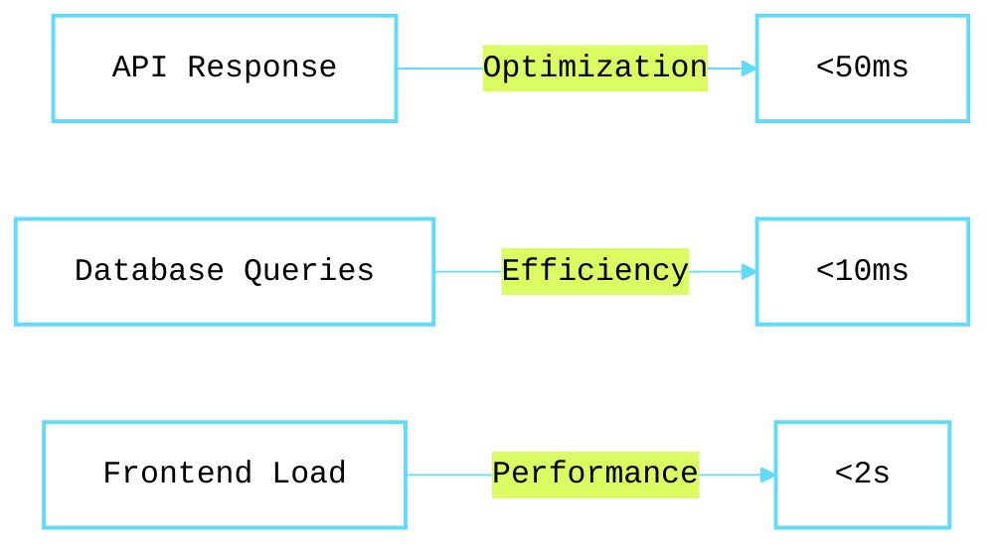
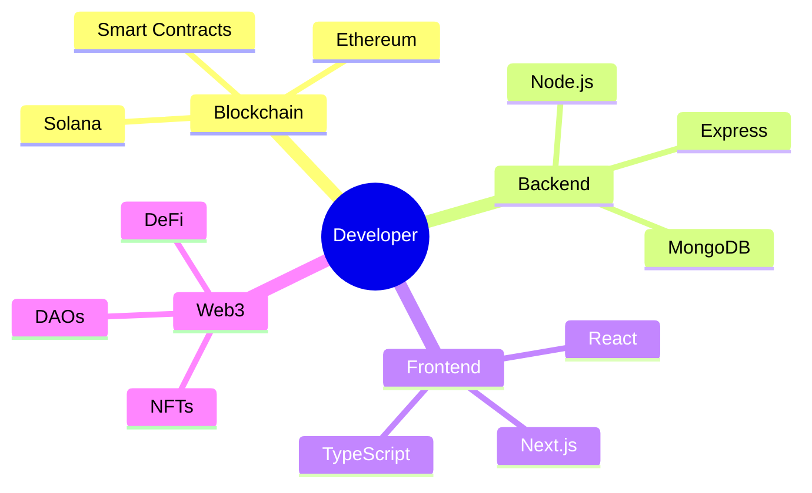

<div align="center" style="background: linear-gradient(135deg, #1a1c2c 0%, #4a569d 100%); color: white; padding: 40px; border-radius: 20px; margin: 20px; min-height: 100vh; width: 100%;">

#  Hi, I'm Sagar Regmi

<div align="center" style="background: linear-gradient(135deg, #1a1c2c 0%, #4a569d 100%); padding: 20px; border-radius: 10px;">
  
  <!-- Custom badges with gradient backgrounds -->
  <a href="https://nodejs.org" target="_blank">
    
  </a>
  <a href="https://solana.com" target="_blank">
    
  </a>
  <a href="https://ethereum.org" target="_blank">
    
  </a>
  
  
  
  [](https://github.com/sagarregmi2057)
  [](https://www.linkedin.com/in/sagar-regmi-60b377216/)
</div>

<div align="center">
  <!-- Gradient line -->
  
</div>


## 🚀 About Me

```javascript
const developer = {
    name: "Sagar Regmi",
    location: "Nepal",
    company: "TrustledgerAi.com",
    roles: [
        "Full Stack Developer",
        "Blockchain Developer",
        "Smart Contract Engineer"
    ],
    focus: [
        "Node.js",
        "React",
        "Solana",
        "Ethereum",
        "Rust",
        "Web3"
    ],
    currentLearning: "Zero Knowledge Proofs",
    funFact: "I debug smart contracts in my dreams"
};
```

<div align="center" style="background: linear-gradient(135deg, #1a1c2c 0%, #4a569d 100%); padding: 20px; border-radius: 10px;">
  
</div>

## 🛠️ Tech Stack

<div align="center">
  <!-- Blockchain & Web3 -->
  
  
  
  
  
  <!-- Full Stack -->
  
  
  
  
  
  <!-- DevOps & Cloud -->
  
  
</div>

## 💻 Code Showcase

```rust
// Solana Program Example
#[program]
pub mod defi_protocol {
    use super::*;
    
    pub fn initialize_vault(ctx: Context<InitializeVault>) -> Result<()> {
        let vault = &mut ctx.accounts.vault;
        vault.authority = ctx.accounts.authority.key();
        vault.total_balance = 0;
        msg!("🚀 DeFi vault initialized successfully!");
        Ok(())
    }
}

// Smart Contract Example (Ethereum)
contract TokenVault {
    mapping(address => uint256) private balances;
    
    function deposit() public payable {
        balances[msg.sender] += msg.value;
        emit Deposit(msg.sender, msg.value);
    }
}

// Full Stack Integration
const initializeBlockchain = async () => {
    try {
        const connection = await setupConnection();
        const wallet = await connectWallet();
        return {
            success: true,
            message: "Blockchain connection established"
        };
    } catch (error) {
        console.error("Initialization failed:", error);
        throw error;
    }
};
```

## 💫 Performance Metrics

<div align="center" style="background: linear-gradient(135deg, #1a1c2c 0%, #4a569d 100%); padding: 20px; border-radius: 10px;">



</div>

## 🌟 Project Highlights

<div align="center">
  <table>
    <tr>
      <td align="center">
        
        <br />
        "Smart contract solutions"
      </td>
      <td align="center">
        
        <br />
        "Web3 innovations"
      </td>
      <td align="center">
        
        <br />
        "Modern applications"
      </td>
    </tr>
  </table>
</div>

## 🎯 Current Focus



## 🎵 Development Playlist:

<div align="center">
```ascii
♪♫•*¨*•.¸¸♫•*¨*•.¸¸♪
🎧 Now Playing: Web3 Symphony in Full Stack Major
═══════════════════ ⠂▶
◄◄⠀▐▐⠀►►⠀⠀ ▇:𝟙𝟚:𝟛𝟘⠀►⠀∞:∞/∞:∞⠀⠀ ▌ ▌⠀⠀ ♫ ♪ ♫

🎼 Dev Playlist:
├── 01. Blockchain Beat
├── 02. Solana Sonata
├── 03. Ethereum Etude
├── 04. React Remix
└── 05. Node.js Nocturne
```
</div>

<div align="center">
  
</div>

<div align="center">
  <sub>Built with ❤️ and 🦀 Rust | Powered by ⚡ Solana and 🌐 Web3 | Crafted by Sagar Regmi</sub>
</div>

</div>
