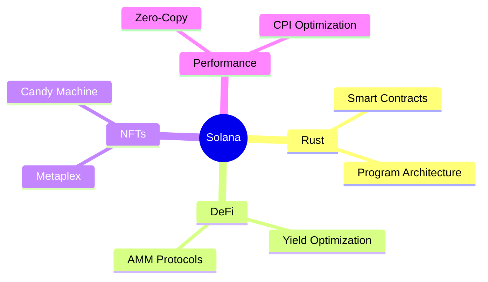
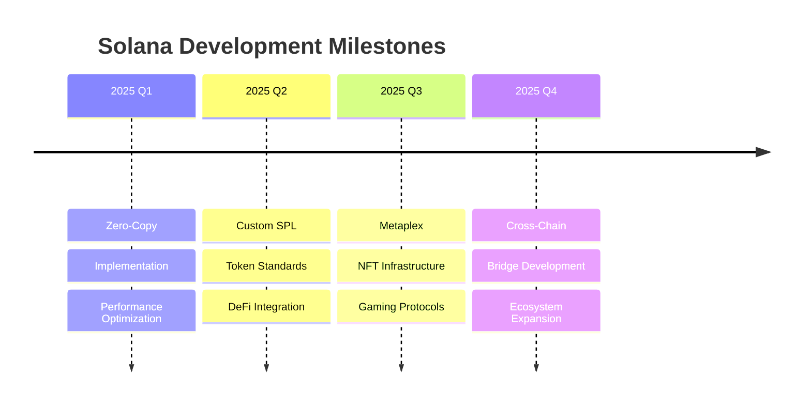

# <div align="center"> Hi, I'm Sagar Regmi</div>

<div align="center">
  
  <!-- Custom badges with gradient backgrounds -->
  <a href="https://solana.com" target="_blank">
    
  </a>
  <a href="https://www.rust-lang.org/" target="_blank">
    
  </a>
  
  
  
  [](https://github.com/sagarregmi2057)
  [](https://www.linkedin.com/in/sagar-regmi-60b377216/)
</div>

<div align="center">
  <!-- Gradient line -->
  
</div>


## 🚀 About Me

```rust
struct Developer {
    name: String,
    location: String,
    company: String,
    role: String,
    focus: Vec<String>,
    current_learning: String,
    fun_fact: String
}

impl Developer {
    fn new() -> Self {
        Developer {
            name: String::from("Sagar Regmi"),
            location: String::from("Germany"),
            company: String::from("TrustledgerAi.com"),
            role: String::from("Solana Developer"),
            focus: vec![
                String::from("Rust"),
                String::from("Solana"),
                String::from("Web3"),
                String::from("DeFi")
            ],
            current_learning: String::from("Zero-Knowledge Proofs"),
            fun_fact: String::from("I dream in Rust")
        }
    }
}
```

<div align="center">
  
</div>

## 🛠️ Tech Arsenal

<div align="center">
  
  
  
  
  
  
  
  
</div>

## 🎨 Solana Program Showcase

```rust
/// A glimpse into my Solana development style
#[program]
pub mod defi_protocol {
    use super::*;
    
    #[derive(Accounts)]
    pub struct Initialize<'info> {
        #[account(init, payer = authority, space = 8 + 32)]
        pub vault: Account<'info, Vault>,
        #[account(mut)]
        pub authority: Signer<'info>,
        pub system_program: Program<'info, System>,
    }

    pub fn initialize(ctx: Context<Initialize>) -> Result<()> {
        let vault = &mut ctx.accounts.vault;
        vault.authority = ctx.accounts.authority.key();
        msg!("🚀 Vault initialized successfully!");
        Ok(())
    }
}
```

## 💫 Performance Metrics

```mermaid
graph LR
    A[Program Size] -->|Optimization| B[3.2 KB]
    C[CPI Calls] -->|Efficiency| D[0.576 ms]
    E[Memory Usage] -->|Zero-Copy| F[1.8 KB]
    style A fill:#14F195,stroke:#14F195,stroke-width:2px
    style B fill:#000000,stroke:#14F195,stroke-width:2px
    style C fill:#14F195,stroke:#14F195,stroke-width:2px
    style D fill:#000000,stroke:#14F195,stroke-width:2px
    style E fill:#14F195,stroke:#14F195,stroke-width:2px
    style F fill:#000000,stroke:#14F195,stroke-width:2px
```

<div align="center">



</div>

## 🌌 Solana Ecosystem Contributions

<div align="center">
  <table>
    <tr>
      <td align="center">
        
        <br />
        "Enhanced token standards"
      </td>
      <td align="center">
        
        <br />
        "Framework improvements"
      </td>
      <td align="center">
        
        <br />
        "NFT infrastructure"
      </td>
    </tr>
  </table>
</div>

## 🎯 Current Focus



## 🎵 Vibing to the Sound of Solana:

<div align="center">

```ascii
♪♫•*¨*•.¸¸♫•*¨*•.¸¸♪
🎧 Now Playing: Solana Symphony in Rust Major
═══════════════════ ⠂▶
◄◄⠀▐▐⠀►►⠀⠀ ▇:𝟙𝟚:𝟛𝟘⠀►⠀∞:∞/∞:∞⠀⠀ ▌ ▌⠀⠀ ♫ ♪ ♫

🎼 Playlist: Sounds of Solana
├── 01. Rust Rhapsody
├── 02. Solana Sonata
├── 03. Program Prelude
├── 04. Zero-Copy Zen
└── 05. Anchor Anthem
```

<details>
<summary>🎵 Why these tracks?</summary>

> Each "song" represents a different aspect of Solana development:
> - **Rust Rhapsody**: The elegant patterns of Rust programming
> - **Solana Sonata**: The high-performance blockchain symphony
> - **Program Prelude**: The art of smart contract composition
> - **Zero-Copy Zen**: The efficiency of memory management
> - **Anchor Anthem**: The framework that brings it all together

</details>
</div>

<div align="center">
  <!-- Gradient line -->
  
  
  
</div>

## 🌠 Solana Development Journey

<div align="center">

```ascii
                      .─────────────.                      
                    ,'             ,'`.                    
                  ,'             ,'    `.                  
                ,'             ,'        `.                
              ,'             ,'            `.              
            ,'             ,'     ⭐         `.            
          ,'             ,'                   `.          
        ,'  SOLANA     ,'          ⭐           `.        
      ,'  ECOSYSTEM  ,'                          `.      
    ,'             ,'            ⭐                `.    
  ,'   ⭐         ,'                                `.  
,'             ,'                                    `.
`.           ,'                                     ,'
  `.       ,'                            ⭐       ,'  
    `.   ,'                                    ,'    
      `,'                                    ,'      
        `.                                 ,'        
          `.                ⭐           ,'          
            `.                        ,'            
              `.                    ,'              
                `.     ⭐         ,'                
                  `.            ,'                  
                    `.       ,'                    
                      `─────'                      
```

<table>
  <tr>
    <td align="center" width="33%">
      
      <br />
      <sub><b>Performance Focused</b></sub>
    </td>
    <td align="center" width="33%">
      
      <br />
      <sub><b>Speed Optimized</b></sub>
    </td>
    <td align="center" width="33%">
      
      <br />
      <sub><b>Cost Efficient</b></sub>
    </td>
  </tr>
</table>

<details>
<summary>🔮 Future Roadmap</summary>



</details>

<br/>

<table>
  <tr>
    <td>
      
      <div style="width: 120px; background: #1A1B1E; border-radius: 3px; padding: 2px;">
        <div style="width: 95%; background: #B7410E; height: 8px; border-radius: 2px;"></div>
      </div>
    </td>
    <td>
      
      <div style="width: 120px; background: #1A1B1E; border-radius: 3px; padding: 2px;">
        <div style="width: 90%; background: #14F195; height: 8px; border-radius: 2px;"></div>
      </div>
    </td>
    <td>
      
      <div style="width: 120px; background: #1A1B1E; border-radius: 3px; padding: 2px;">
        <div style="width: 85%; background: #FF69B4; height: 8px; border-radius: 2px;"></div>
      </div>
    </td>
  </tr>
</table>

</div>

<div align="center">
  <sub>Built with ❤️ and 🦀 by Sagar Regmi</sub>
</div> 
