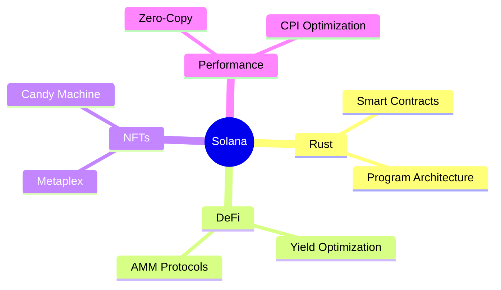

# <div align="center"> Hi, I'm Sagar Regmi</div>

<div align="center">
  
  <!-- Custom badges with gradient backgrounds -->
  <a href="https://solana.com" target="_blank">
    
  </a>
  <a href="https://www.rust-lang.org/" target="_blank">
    
  </a>
  
  
  
  [](https://github.com/sagarregmi2057)
  [](https://www.linkedin.com/in/sagar-regmi-60b377216/)
</div>

<div align="center">
  <!-- Gradient line -->
  
</div>


## 🚀 About Me

```rust
struct Developer {
    name: String,
    location: String,
    company: String,
    role: String,
    focus: Vec<String>,
    current_learning: String,
    fun_fact: String
}

impl Developer {
    fn new() -> Self {
        Developer {
            name: String::from("Sagar Regmi"),
            location: String::from("Germany"),
            company: String::from("TrustledgerAi.com"),
            role: String::from("Solana Developer"),
            focus: vec![
                String::from("Rust"),
                String::from("Solana"),
                String::from("Web3"),
                String::from("DeFi")
            ],
            current_learning: String::from("Zero-Knowledge Proofs"),
            fun_fact: String::from("I dream in Rust")
        }
    }
}
```

<div align="center">
  
</div>

## 🛠️ Tech Arsenal

<div align="center">
  
  
  
  
  
  
  
  
</div>

## 🌟 Featured Projects

<table>
  <tr>
    <td width="50%">
      <h3 align="center">🦀 Solana DeFi Protocol</h3>
      <div align="center">
        
        <p><strong>Building next-gen DeFi on Solana</strong></p>
      </div>
    </td>
    <td width="50%">
      <h3 align="center">🎨 Solana NFT Platform</h3>
      <div align="center">
        
        <p><strong>Revolutionary NFT platform on Solana</strong></p>
      </div>
    </td>
  </tr>
</table>

## 📊 GitHub Analytics

<div align="center">
  
  
</div>

## 🎯 Current Focus



## 💫 Achievements & Contributions

<div align="center">
  
  [](https://github.com/ryo-ma/github-profile-trophy)
  
</div>

## 🎵 Vibing to the Sound of Solana:

<div align="center">

```ascii
♪♫•*¨*•.¸¸♫•*¨*•.¸¸♪
🎧 Now Playing: Solana Symphony in Rust Major
═══════════════════ ⠂▶
◄◄⠀▐▐⠀►►⠀⠀ ▇:𝟙𝟚:𝟛𝟘⠀►⠀∞:∞/∞:∞⠀⠀ ▌ ▌⠀⠀ ♫ ♪ ♫

🎼 Playlist: Sounds of Solana
├── 01. Rust Rhapsody
├── 02. Solana Sonata
├── 03. Program Prelude
├── 04. Zero-Copy Zen
└── 05. Anchor Anthem
```

<details>
<summary>🎵 Why these tracks?</summary>

> Each "song" represents a different aspect of Solana development:
> - **Rust Rhapsody**: The elegant patterns of Rust programming
> - **Solana Sonata**: The high-performance blockchain symphony
> - **Program Prelude**: The art of smart contract composition
> - **Zero-Copy Zen**: The efficiency of memory management
> - **Anchor Anthem**: The framework that brings it all together

</details>
</div>

<div align="center">
  <!-- Gradient line -->
  
  
  
</div>

<!-- Snake animation -->
<picture>
  <source media="(prefers-color-scheme: dark)" srcset="https://raw.githubusercontent.com/sagarregmi2057/sagarregmi2057/output/github-contribution-grid-snake-dark.svg">
  <source media="(prefers-color-scheme: light)" srcset="https://raw.githubusercontent.com/sagarregmi2057/sagarregmi2057/output/github-contribution-grid-snake.svg">
  
</picture> 
