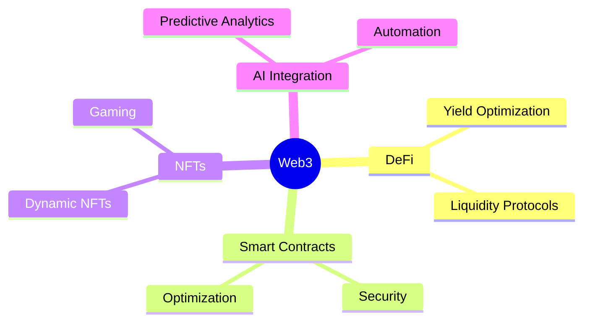

#  Hi, I'm Sagar Regmi

<div align="center">
  
  
  [](https://github.com/sagarregmi2057)
  [](https://www.linkedin.com/in/sagar-regmi-60b377216/)
</div>


## 🚀 About Me

```typescript
const sagar = {
    location: "Germany",
    company: "TrustledgerAi.com",
    role: "Web3 Developer",
    focus: ["Blockchain", "DeFi", "NFTs", "Smart Contracts"],
    currentlyLearning: "Zero-Knowledge Proofs",
    askMeAbout: ["Web3", "Blockchain", "DeFi", "NFTs"],
    funFact: "I dream in Solidity"
};
```

<div align="center">
  
</div>

## 🛠️ Tech Arsenal

<div align="center">
  
  
  
  
  
  
  
  
  
  
</div>

## 🌟 Featured Projects

<table>
  <tr>
    <td width="50%">
      <h3 align="center">🔗 DeFi Innovation Hub</h3>
      <div align="center">
        
        <p><strong>Building next-gen DeFi solutions</strong></p>
      </div>
    </td>
    <td width="50%">
      <h3 align="center">🎨 NFT Marketplace</h3>
      <div align="center">
        
        <p><strong>Revolutionary NFT trading platform</strong></p>
      </div>
    </td>
  </tr>
</table>

## 📊 GitHub Analytics

<div align="center">
  
  
</div>

## 🎯 Current Focus



## 💫 Achievements & Contributions

<div align="center">
  
  [](https://github.com/ryo-ma/github-profile-trophy)
  
  
  
</div>

## 🤝 Let's Connect and Build Together

<div align="center">
  <a href="https://www.linkedin.com/in/sagar-regmi-60b377216/">
    
  </a>
  <a href="https://github.com/sagarregmi2057">
    
  </a>
</div>

---

<div align="center">
  
  
  <h4>🎵 Vibing to the Sound of Blockchain:</h4>
  
  ```ascii
  ♪♫•*¨*•.¸¸♫•*¨*•.¸¸♪
  🎧 Now Playing: Ethereum Symphony
  ═══════════════════ ⠂▶
  ◄◄⠀▐▐⠀►►⠀⠀ ▇:𝟙𝟚:𝟛𝟘⠀►⠀∞:∞/∞:∞⠀⠀ ▌ ▌⠀⠀ ♫ ♪ ♫
  
  🎼 Playlist: Sounds of the Metaverse
  ├── 01. Blockchain Beats
  ├── 02. Crypto Cadence
  ├── 03. DeFi Dynamics
  ├── 04. NFT Nocturne
  └── 05. Web3 Wavelengths
  ```

  <details>
  <summary>🎵 Why these tracks?</summary>
  
  > Each "song" represents a different aspect of Web3 development:
  > - **Blockchain Beats**: The rhythmic pattern of block creation
  > - **Crypto Cadence**: The flow of transactions in the network
  > - **DeFi Dynamics**: The harmonious interaction of DeFi protocols
  > - **NFT Nocturne**: The artistic essence of digital ownership
  > - **Web3 Wavelengths**: The resonance of decentralized innovation
  
  </details>
</div>

 
